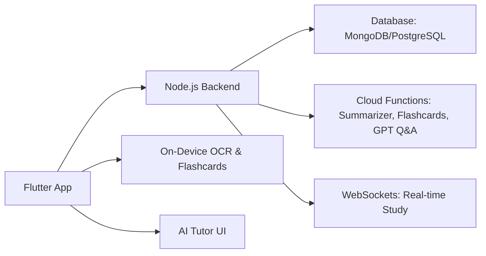

# EduScan Pro 📚✨  
**Intelligent Study Scanner, Organizer & AI Tutor**  
A cross-platform AI-powered Flutter app designed to help students scan, structure, and learn from any printed or handwritten material—backed by a Node.js backend with real-time collaboration, cloud inference, and personalized study analytics.

---

## 🚀 Features Overview

### 1. 📷 Smart Study Scanner (Flutter + AI)
- **Live OCR Scanning**
  - Real-time camera capture with auto-crop and perspective correction.
  - Supports printed text, equations, and handwritten notes using on-device OCR (Tesseract or Google ML Kit).
- **Intelligent Structuring**
  - Automatically classifies content into subjects (e.g. Math, History, Science).
  - Breaks content into headings, paragraphs, tables, and bullet points.
- **Summarization & Flashcard Generation**
  - AI summarizes each section into concise key points using Transformer models.
  - Auto-generates question-answer flashcards including fill-in-the-blank and multiple-choice variants.

### 2. 🧠 Adaptive Tutor Engine (AI/ML)
- **Context-Aware Q&A Tutor**
  - Fine-tuned GPT model that answers questions based on your uploaded material.
  - Learns from your notes, summaries, and scanned documents.
- **Personalized Learning Paths**
  - Tracks flashcard performance and quiz history.
  - Adapts with spaced repetition and surfaces weaker topics over time.
- **On-Device & Cloud Inference**
  - OCR and flashcards run offline.
  - Summarization and GPT-powered Q&A require backend inference for optimal responses.

### 3. 🌐 Collaborative Learning Backend (Node.js)
- **RESTful & WebSocket APIs**
  - Upload and tag scans with version control in MongoDB/PostgreSQL.
  - Real-time study groups: co-annotate, quiz together using Socket.IO.
- **User Profiles & Analytics**
  - JWT-based authentication, stores user progress, flashcard history, and study trends.
  - GraphQL layer for insights: daily time spent, mastery heatmaps, topic weaknesses.
- **Serverless Model Processing**
  - Uses AWS Lambda or Google Cloud Functions for compute-heavy tasks.
  - Caches structured results and tutor sessions for reuse.

---

## 🧩 System Architecture



---

## 🔧 Tech Stack

### Frontend (Flutter)
- Flutter 3+ (Dart)
- Tesseract OCR / Google ML Kit
- Riverpod / Bloc (for state management)
- Flutter WebSocket client
- Hive / SharedPreferences (local storage)

### Backend (Node.js)
- Express.js + Socket.IO
- MongoDB / PostgreSQL
- AWS Lambda / Google Cloud Functions
- JWT Authentication
- GraphQL (Apollo Server)

### AI/ML Stack
- Hugging Face Transformers for summarization
- Custom Q&A model fine-tuned on user notes
- Flashcard generation logic (BERT-style entity masking + MCQ distractor logic)

---

## 🗂️ Project Structure

```
/eduscan-pro/
│
├── frontend/               # Flutter app
│   ├── lib/
│   ├── assets/
│   └── test/
│
├── backend/                # Node.js server
│   ├── src/
│   │   ├── routes/
│   │   ├── controllers/
│   │   ├── models/
│   │   ├── services/
│   │   └── sockets/
│   └── .env
│
├── functions/              # Cloud Functions
│   ├── summarizer/
│   ├── flashcards/
│   └── tutorQA/
│
├── README.md
└── docs/
```

---

## 🧪 Getting Started

### Prerequisites

- Flutter 3.x
- Node.js 18+
- MongoDB or PostgreSQL instance
- Firebase or AWS/GCP account (for cloud functions)
- [SurrealDB optional if used instead of SQL/NoSQL]

---

## 🧠 AI/ML Deployment Notes

- GPT/Q&A model hosted on cloud using serverless inference or Hugging Face Spaces.
- Summarizer model deployed as an endpoint in cloud function.
- Flashcard generation uses NLP masking + syntactic distractor generation logic.

---

## 📈 Future Plans

- ✨ Full offline support with quantized models.
- 📝 Handwriting recognition with support for math notation.
- 📅 Weekly study goals and reminders.
- 🧑‍🏫 Teacher/admin dashboard for monitoring multiple users.

---

## 🤝 Contributing

We're open to contributions! Please open an issue or submit a pull request if you’d like to contribute code, report bugs, or request features.
